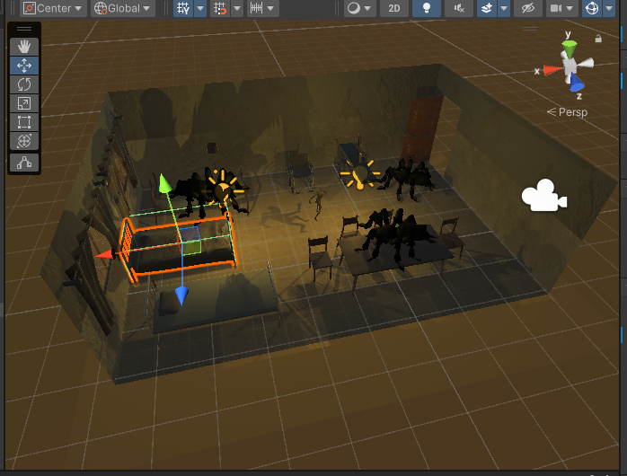
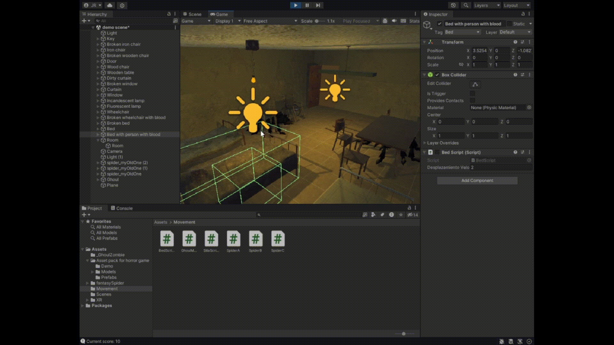
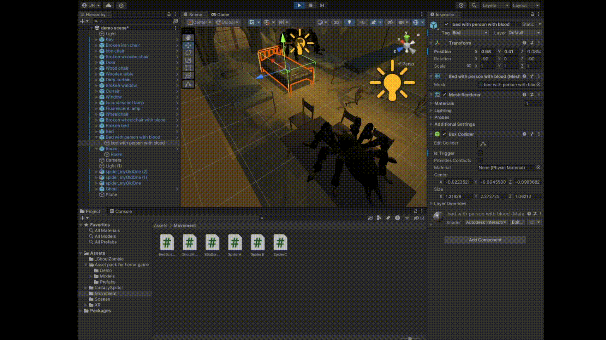

# Examen-II

## Ejercicio 1: Crear una escena terrorífica usando el asset store

## Ejercicio 2: Darle moviemiento al ghoul
### Se creó en el script de movimiento GhoulMovement

## Crear un script que añada 10 puntos al contador cuando salte por encima de una araña
## Se incorporó la mecánica dentro del script de movimiento de ghoul.

## Hacer que 1 araña salte todo el rato, otra araña se mueve en dos posiciones donde se escogen aleatoriamente y una última araña que vaya a una silla y se quede ahí
### Para ello se crearon los script SpiderA, SpiderB y SpiderC.

## Crear un script que al tocar una cama mueva aleatoriamente de sentido las otras camas y haga saltas todas las sillas
## Se utilizaron eventos dentro de los scripts de Bet y Chair.

